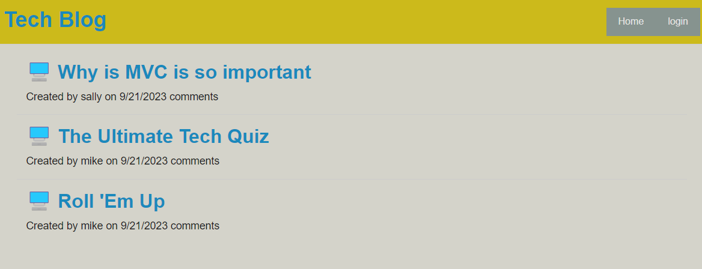
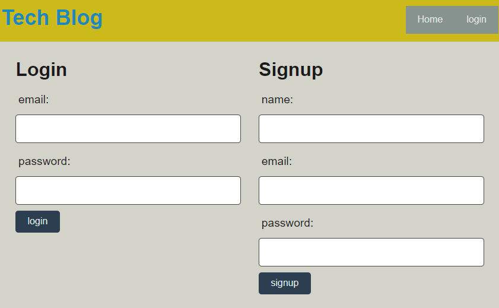

# Techblog

## Table of Contents (Optional)

- [Description](#description)
- [Installation](#installation)
- [Usage](#usage)
- [License](#license)
- [Contact](#questions)

## Description
This app is designed for Technology Blogging. 

## Installation
 Install node package. In terminal, enter: npm i

 Update .env.EXAMPLE file. Rename it to .env. Then update DB_USER & DB_PASSWORD for your mysql account. 

 In Mysql, create the database, enter: Source ./db/schema.sql.

 Run seeds by typing in root folder terminal: npm run seed

Once complete, you can type "npm start" to run the server. 

## Usage
Once server is up and functional, here is a photo of the homepage: 

You will need to log in to post your blog. 

(The rest, "in progress"...)

## License
  MIT License

    Copyright (c) 2023, Github username: s0m3y3
    
    Permission is hereby granted, free of charge, to any person obtaining a copy of this software and associated documentation files (the "Software"), to deal in the Software without restriction, including without limitation the rights to use, copy, modify, merge, publish, distribute, sublicense, and/or sell copies of the Software, and to permit persons to whom the Software is furnished to do so, subject to the following conditions: The above copyright notice and this permission notice shall be included in all copies or substantial portions of the Software.
    
    THE SOFTWARE IS PROVIDED "AS IS", WITHOUT WARRANTY OF ANY KIND, EXPRESS OR IMPLIED, INCLUDING BUT NOT LIMITED TO THE WARRANTIES OF MERCHANTABILITY, FITNESS FOR A PARTICULAR PURPOSE AND NONINFRINGEMENT. IN NO EVENT SHALL THE AUTHORS OR COPYRIGHT HOLDERS BE LIABLE FOR ANY CLAIM, DAMAGES OR OTHER LIABILITY, WHETHER IN AN ACTION OF CONTRACT, TORT OR OTHERWISE, ARISING FROM, OUT OF OR IN CONNECTION WITH THE SOFTWARE OR THE USE OR OTHER DEALINGS IN THE SOFTWARE.

## Contact
Github user: s0m3y3

Github Repo: [Link](https://github.com/s0m3y3/Tech_Blog
